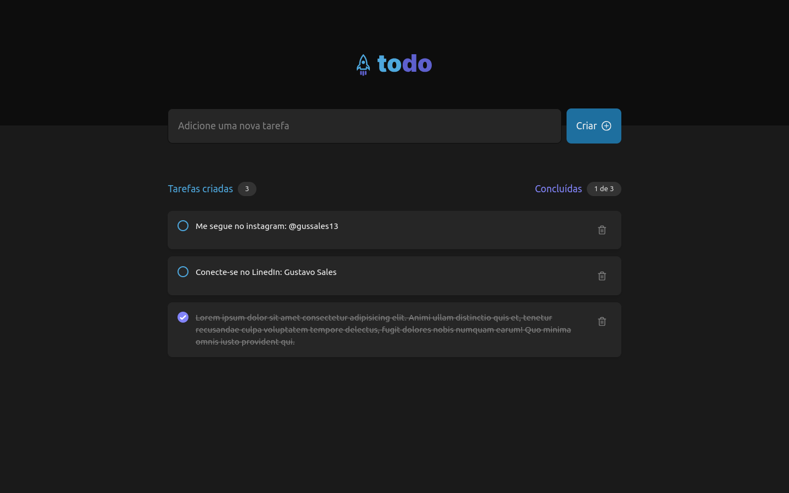

# ToDo List
Esta é uma aplicação web onde o usuário pode criar e gerenciar tarefas no estilo <i>to do</i>.

## 🔨 Funcionalidades do projeto

- O usuário pode criar, excluir tarefas, e indicar se ele já finalizou a tarefa. Tudo isso sem a necessidade de criar uma conta.

- `Criação de uma tarefa`: Utilizando conceitos de estados em React, o usuário preenche um formulário contendo o campo de conteúdo da tarefa e salvando apenas apertando o botão criar. Após isso, a tarefa estará disponível no campo de tarefas criadas.

- `Exclusão de tarefa`: Ao lado da descrição da tarefa, há um ícone de lixeira, que apertando, o usuário poderá excluir a tarefa.

- `Alterando o status da tarefa`: Ao clicar no círculo do lado esquerdo da descrição da tarefa, o usuário indicará que essa tarefa foi finalizada com sucesso, indicando visualmente que ele não precisa mais se preocupar com ela.

## ✔️ Técnicas e tecnologias utilizadas

Este projeto foi desenvolvido utilizando as principais tecnologias de desenvolvimento web utilizadas no mercado atualmente.
- React (Vite);
- Tailwindcss;
- Typescript.

Alguns conceitos que foram utilizados: 
- Estados em React (utilizando o hook useState);
- Utilizando contextos para compartilhar estados entre componentes (Context API).


## 🛠️ Abrir e rodar o projeto

1. Após realizar o download ou clone do projeto, abra a pasta do projeto em um terminal e realize a instalação das dependências utilizando:
```bash
pnpm install
```
Caso esteja utilizando *npm* como gerenciador de pacotes, utilize:
```bash
npm install
```

2. Após a instalação das dependências, execute o projeto utilizando:
```bash
pnpm dev
```
ou
```bash
npm run dev
```